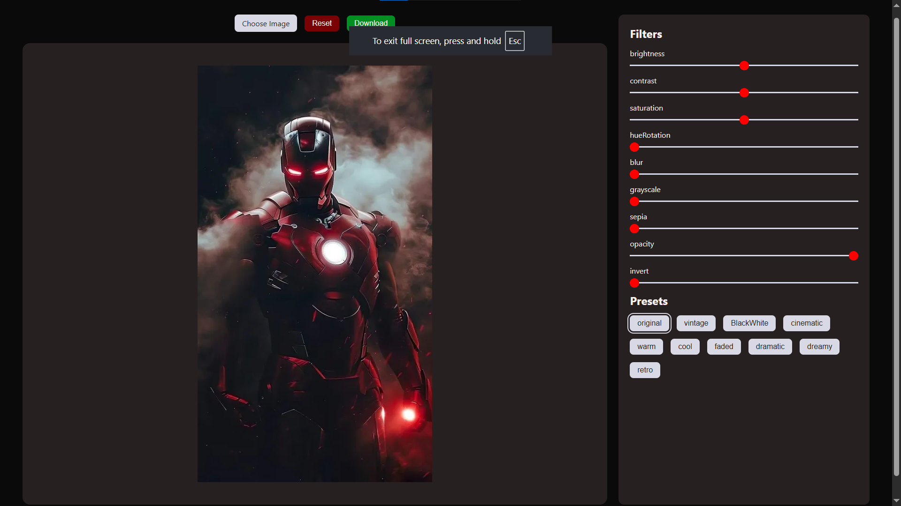
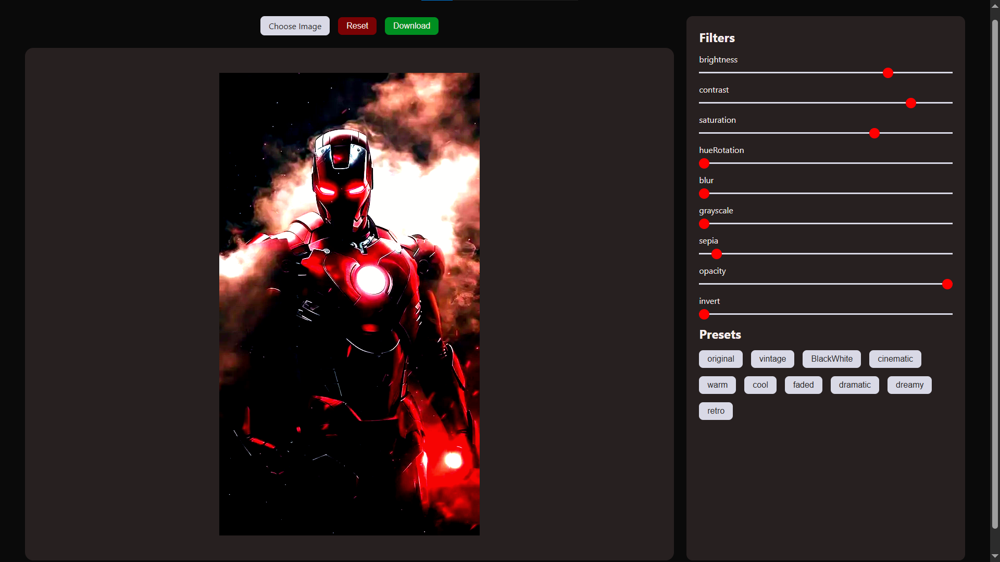

# 🖼️ Image Editor

A modern and responsive **Image Editor** built with **HTML5, CSS3, and Vanilla JavaScript**. Edit images in real-time using multiple filters, apply built-in presets, and download the edited image instantly.

---

## 📸 Preview

### Original Image



### Edited Image



---

## ✨ Features

- 📤 Upload Image
- 🎨 Real-time Image Editing
- ☀️ Brightness Adjustment
- 🌗 Contrast Adjustment
- 🌈 Saturation Control
- 🎭 Hue Rotation
- 🌫️ Blur Effect
- ⚫ Grayscale Filter
- 🟤 Sepia Filter
- 👻 Opacity Control
- 🔄 Invert Colors
- 🎛️ Built-in Presets
  - Original
  - Vintage
  - Black & White
  - Cinematic
  - Warm
  - Cool
  - Faded
  - Dramatic
  - Dreamy
  - Retro
- 🔄 Reset Filters
- 💾 Download Edited Image
- 📱 Responsive User Interface

---

## 🛠️ Technologies Used

- HTML5
- CSS3
- JavaScript (ES6)
- HTML5 Canvas API
- Remix Icons

---

## 📂 Project Structure

```text
Image-editor/
│
├── assets/
│   ├── edited-image.png
│   └── orignal-image.png
│
├── index.html
├── script.js
├── style.css
├── theme.css
└── README.md
```

---

## 🚀 Getting Started

1. Clone the repository

```bash
git clone https://github.com/vishesh4u/Image-editor.git
```

2. Open the project folder

```bash
cd Image-editor
```

3. Open `index.html` in your browser.

---

## 🎯 Future Improvements

- ✂️ Crop Tool
- 🔄 Rotate Image
- ↔️ Flip Image
- 🔍 Zoom In / Zoom Out
- ↩️ Undo / Redo
- 🖱️ Drag & Drop Image Upload
- 🌙 Light/Dark Theme Toggle
- 🖌️ Drawing Tools

---

## 👨‍💻 Author

**Vishesh Gurjar**

GitHub: https://github.com/vishesh4u

---

## ⭐ Support

If you found this project helpful, please consider giving it a **⭐ Star** on GitHub.
